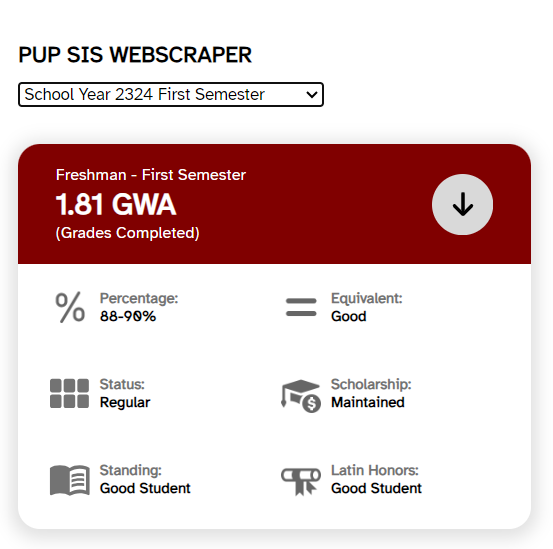

# PUPSIS Grades and Contact Grabber

A Chrome extension that scrapes student grades and contact information from the PUPSIS (Polytechnic University of the Philippines Student Information System).

## Features
- **Extract Grades**: Retrieve student grades from the PUPSIS system.
- **Grab Contact Information**: Fetch available contact details from the student information system.
- **Export Data**: Export the scraped data in a structured format like CSV or JSON.

## Installation
1. Clone the repository:
```bash
   git clone https://github.com/aidantiu/PUPSIS-Grades-and-Contact-Grabber.git
   cd PUPSIS-Grades-and-Contact-Grabber
```
2. Load the extension in Chrome:
    - Open chrome://extensions/.
    - Enable Developer Mode.
    - Click on Load unpacked and select the project folder.

# How to use
1. Login credential first in the PUPSIS website

2. Click on the grades section in the navigation bar

3. Click the extension and select a term 


# Contributing
1. Fork the repository
2. Create a branch for your addition/feature:
```bash
git checkout -b branchname
```
3. Stage additions/feature
```bash
git add .
```
4. Commit changes
```bash
git commit -m 'sample message'
```
5. Push to your branch
```bash
git push origin branchname
```
6. Open a pull request.